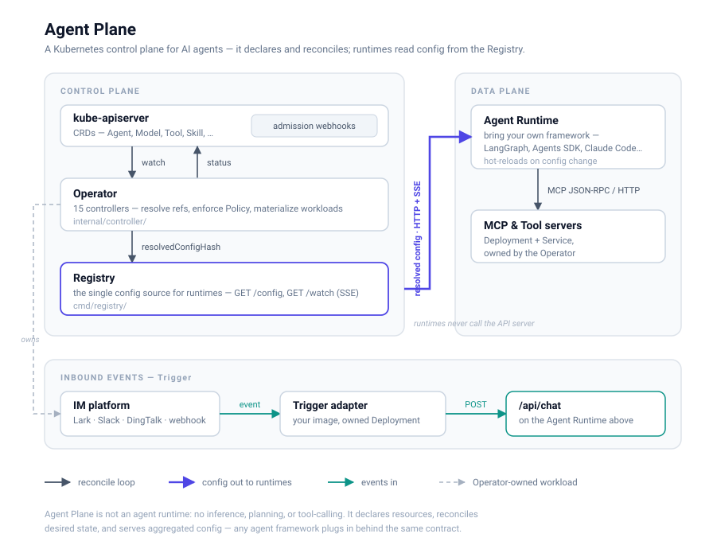

# Agent Plane — Kubernetes-Native Agent Control Plane

Agent Plane is a **control plane** for AI Agents, built with the Kubernetes Operator
pattern. It manages the _declaration, lifecycle, and configuration_ of Agents
and the resources they are composed from — Models, Tools, Skills, MCP servers,
Prompts, Policies, and more — as first-class Custom
Resources.

> Agent Plane is **not** an Agent runtime. It does not do inference, planning, ReAct,
> tool-calling, or memory implementation. It declares resources, reconciles
> desired state, and serves aggregated configuration to runtimes through the
> **Registry**. Any Agent framework (LangGraph, OpenAI Agents SDK, CrewAI, …)
> can plug in as a runtime.

## Architecture

<p align="center"></p>

- **Operator** (`cmd/main.go`, `internal/controller/`) watches all Agent Plane
  resources, validates and resolves references, materializes workloads, and
  publishes status.
- **Registry** (`cmd/registry/`) is the single configuration source for
  runtimes. Runtimes ask the Registry for an Agent's fully-resolved config;
  they never talk to the Kubernetes API directly. It exposes:
  - `GET /v1/agents/{ns}/{name}/config` — one-shot resolved config snapshot.
  - `GET /v1/agents/{ns}/{name}/watch` — Server-Sent Events stream that pushes a
    fresh config whenever the Agent changes (**hot reload**). The Registry
    watches only Agents; the Operator folds dependency changes into the Agent's
    `resolvedConfigHash`, so an Agent event covers any change that matters.
- **Admission webhooks** (`internal/webhook/v1alpha1/`) validate _structural_
  invariants at apply time (fail fast) for Agent (no duplicate refs) and Tool
  (an `mcp` tool needs an `mcpServerRef`). The same checks live in
  `api/v1alpha1/validation.go` and are
  reused by the controllers — cross-object _existence_ is deliberately left to
  the controllers' eventual consistency so GitOps can apply in any order.

## Resource model (`core.hkmdxlftjf.io/v1alpha1`)

| Kind               | Purpose                                                                                                                                                   |
| ------------------ | --------------------------------------------------------------------------------------------------------------------------------------------------------- |
| **Agent**          | Declares an agent as references to the capabilities it is built from.                                                                                     |
| **AgentClass**     | Reusable defaults inherited by Agents.                                                                                                                    |
| **Model**          | A model endpoint (openai/anthropic/azure/ollama/vllm/openrouter/custom).                                                                                  |
| **Tool**           | A single executable capability the agent _calls_ — `http` (POST JSON) or `mcp` (an MCPServer, or another Agent via `agentRef`).                           |
| **ToolSet**        | A named bundle of Tools.                                                                                                                                  |
| **Skill**          | A markdown instruction pack (SKILL.md-style) that teaches the agent _how_ to do something; its `allowedTools` confine the agent once the skill is loaded. |
| **MCPServer**      | An MCP server; the Operator materializes it into a Deployment + Service.                                                                                  |
| **PromptTemplate** | Versioned system/role prompts and few-shot examples.                                                                                                      |
| **Policy**         | Coarse allow/deny over models/mcp/tools. Enforced: the Operator refuses to run an Agent whose refs are denied.                                             |
| **ToolPolicy**     | Per-Tool authorization and per-session call caps. Enforced by the runtime at call time.                                                                   |
| **Credential**     | Indirects secret material through a Kubernetes Secret.                                                                                                    |
| **Trigger**        | An _inbound_ event source (IM bot, webhook) feeding an Agent, run as an owned adapter Deployment.                                                         |

An Agent may additionally bind a **repository** (`spec.workspace`) and publish
itself to peers (`spec.expose`) — see _Coding agents_ below.

### The reference controllers

- **`AgentReconciler`** — the _aggregating_ pattern. Resolves every reference an
  Agent declares; if any is missing, marks the Agent `Degraded` with reason
  `ReferenceNotFound`. If everything exists but a referenced **Policy** forbids
  one of them, marks it `Degraded` with reason `PolicyViolation` — reported on a
  separate `PolicyCompliant` condition, so "the Model is missing" stays
  distinguishable from "the Model exists but this Agent may not use it".
  Otherwise computes a stable `resolvedConfigHash` over all resolved references
  (so runtimes/Registry can detect drift) and marks the Agent `Ready`. Watches
  all referenceable kinds so a change to a dependency re-reconciles the Agents
  that use it.
- **`TriggerReconciler`** — the same resource-owning pattern applied to _inbound_
  events: it materializes the adapter Deployment for a Trigger and injects the
  adapter contract, so bringing a new IM platform on board is an image plus a
  YAML, not a control-plane change.
- **`MCPServerReconciler`** — the _resource-owning_ pattern. Creates and owns a
  `Deployment` + `Service` for each MCPServer via `CreateOrUpdate` +
  `SetControllerReference`, and reflects availability into status.

The remaining 9 controllers follow the same two shapes: **reference-resolving**
(Model, Tool, ToolSet, Skill, AgentClass, Credential) validate
and resolve what they point at, and **validation-only** (ToolPolicy,
Policy, PromptTemplate) check internal consistency. Each watches the kinds it
depends on, so the reference graph converges automatically — a resource stuck
`Degraded` on a missing dependency flips to `Ready` as soon as that dependency
is created.

Those watches are **reference-precise**: field indexes (`SetupFieldIndexes`) map
a changed dependency back to just the resources naming it, rather than every
resource in the namespace. Two indirect routes are followed explicitly, since
missing them would drop events rather than merely waste work — an Agent
inheriting a `modelRef` from its AgentClass, and a Tool reaching an Agent
through a ToolSet.

Policy and ToolPolicy have no workload of their own, so their controllers only
publish readiness — but the rules are _not_ inert. `AgentReconciler` merges the
policies each Agent references and refuses to run it if its declaration is
forbidden; the Registry ships the same merged view to runtimes, which enforce the
call-time half. See **[docs/usage.md](docs/usage.md)** §12.

## Getting started

Prerequisites: Go 1.24+, Docker, `kubectl`, and access to a cluster
(e.g. `kind`).

```sh
# Generate code + CRDs (already committed, but safe to re-run)
make generate manifests

# Compile everything
make build            # operator -> bin/manager
make build-registry   # registry -> bin/registry

# Install CRDs and run the operator against your current kube context
make install
make run

# In another shell, apply the coherent sample set
kubectl apply -k config/samples

# Watch the Agent resolve its references and the MCPServer spawn a Deployment
kubectl get agents,mcpservers
kubectl get deploy,svc -l app.kubernetes.io/managed-by=agent-plane

# Serve resolved config to runtimes and fetch one Agent's config
make run-registry &
curl localhost:9090/v1/agents/default/support-agent/config | jq

# Stream hot-reload updates for one Agent (edit the Agent in another shell to see a push)
curl -N localhost:9090/v1/agents/default/support-agent/watch
```

> Webhooks are wired into the manager and run by default; set
> `ENABLE_WEBHOOKS=false` to disable them when running locally without certs.
> In-cluster they require cert-manager (uncomment the `webhook`/`cert-manager`
> entries in `config/default/kustomization.yaml`).

## Operator-managed runtime (`spec.runtime`)

By default Agent Plane is purely declarative: you bring your own runtime and point it
at the Registry. Optionally, the Operator can **deploy the runtime for you** from
the Agent CR (pull model) — set `spec.runtime` and the `AgentReconciler`
materializes an owned Deployment (+ optional Service), the same way it
materializes an `MCPServer`:

```yaml
spec:
  modelRef: { name: llm-model }
  runtime:
    image: myorg/my-runtime:v1 # your runtime image (BYO); Agent Plane does not do inference
    replicas: 2
    port: 8080 # optional → also creates a Service
```

The Operator injects `AGENTPLANE_REGISTRY`, `AGENTPLANE_AGENT_NAMESPACE`, and
`AGENTPLANE_AGENT_NAME`; the runtime container pulls its config from the in-cluster
Registry and hot-reloads on change. In-cluster Registry manifests are
in `config/registry/`. See **[docs/usage.md](docs/usage.md)** §8 and
**[docs/runtime-protocol.md](docs/runtime-protocol.md)** for the full contract.

## Coding agents: one repo per Agent

A coding agent (Claude Code, Codex, OpenCode, …) needs a working tree, and a
working tree has exactly one writer — so the unit is **one Agent, one
repository, one pod**:

```yaml
kind: Agent
spec:
  agentClassRef: { name: backend-role } # role: model + prompt + guardrails
  workspace:
    repository: https://github.com/org/api
    credentialRef: { name: git-token }
  runtime: { image: your-coding-agent:latest, port: 8080 }
```

The Operator provisions a volume, clones into it, and pins the Deployment to a
single replica with `Recreate` — two pods on one checkout is never correct.

**Cross-repository work is a declared edge, not a shared mount.** An Agent that
should answer others sets `spec.expose`; another reaches it through an ordinary
`Tool` whose `agentRef` names it. Because the edge is a Tool, **Policy and
ToolPolicy already govern it** — deny the Tool and the link is severed, with no
separate agent-to-agent permission model. Isolation is the default: an Agent
with no peer Tool cannot reach any other.

The runtime image is yours to supply: anything honoring
[docs/runtime-protocol.md](docs/runtime-protocol.md) works. A coding agent fits
by _projection_ — the Registry's config is written into whatever the agent
already reads, rather than the agent being patched to understand this platform.
`Dockerfile.coding-agent` builds one: opencode, plus a plugin that projects the
config in-process and can hold an IM connection alongside it, so an approval
blocks the actual tool call instead of relying on the model to volunteer a pause.

See **[docs/usage.md](docs/usage.md)** §14,
`config/samples/coding/repo-agents.yaml`, and
`config/samples/coding/lark-coding-agent.yaml`.

## Inbound events (`Trigger`)

Tools are how an Agent calls _out_. A **Trigger** is the other direction: an IM
bot or webhook bringing messages _in_.

Agent Plane implements no platform protocol. You supply an adapter image; the
Operator runs it as an owned Deployment, mounts its credentials, and injects the
address of the Agent's runtime:

```yaml
kind: Trigger
spec:
  agentRef: { name: support-agent }
  image: myorg/lark-adapter:v1 # swap for DingTalk, Slack, …
  credentialRef: { name: lark-app }
  config: { events: ["im.message.receive_v1"] }
```

The adapter connects to the platform, POSTs `{sessionId, message}` to
`$AGENTPLANE_AGENT_ENDPOINT/api/chat`, and posts the answer back. Using the
platform's conversation id as `sessionId` gives multi-turn memory for free.

**Adding a platform is a new image and a new Trigger** — no control-plane
change, which is the point of fixing a contract instead of building integrations
in. See **[docs/adapter-protocol.md](docs/adapter-protocol.md)** and
`config/samples/inbound/lark-trigger.yaml`.

## Documentation

- **[docs/usage.md](docs/usage.md)** — full usage guide (deploy, declarative &
  programmatic usage, data plane, runtime, FAQ).
- **[docs/runtime-protocol.md](docs/runtime-protocol.md)** — the runtime
  configuration & change-notification protocol (v1): config flowing _out_ to a
  runtime.
- **[docs/adapter-protocol.md](docs/adapter-protocol.md)** — the inbound adapter
  contract (v1): events flowing _in_ from Lark/DingTalk/Slack/…. Implement it in
  any language and your adapter runs under a `Trigger` unchanged.

## Roadmap (out of scope for this scaffold)

- Registry gRPC transport and event-bus fan-out (HTTP + SSE are implemented)
- Defaulting / conversion webhooks (validating webhooks are implemented)
- Narrowing the manager's Secret/ConfigMap _cache_ (enqueue is already
  reference-precise; the informer still watches them cluster-wide)
- Multi-tenant scoping (Namespace / Cluster / Tenant)
- Metrics dashboards and tracing wiring
- Reference runtime integrations (LangGraph, Agents SDK, CrewAI)
- Further `Tool` types — `grpc`, `wasm`, `plugin`, `container`. These were once
  listed in the CRD enum with no implementation behind them, so such a Tool
  applied cleanly and failed only when a runtime tried to call it; they are
  tracked here until the Registry resolves them.

## License

Apache 2.0.
